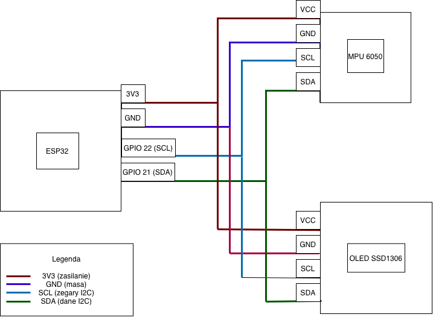
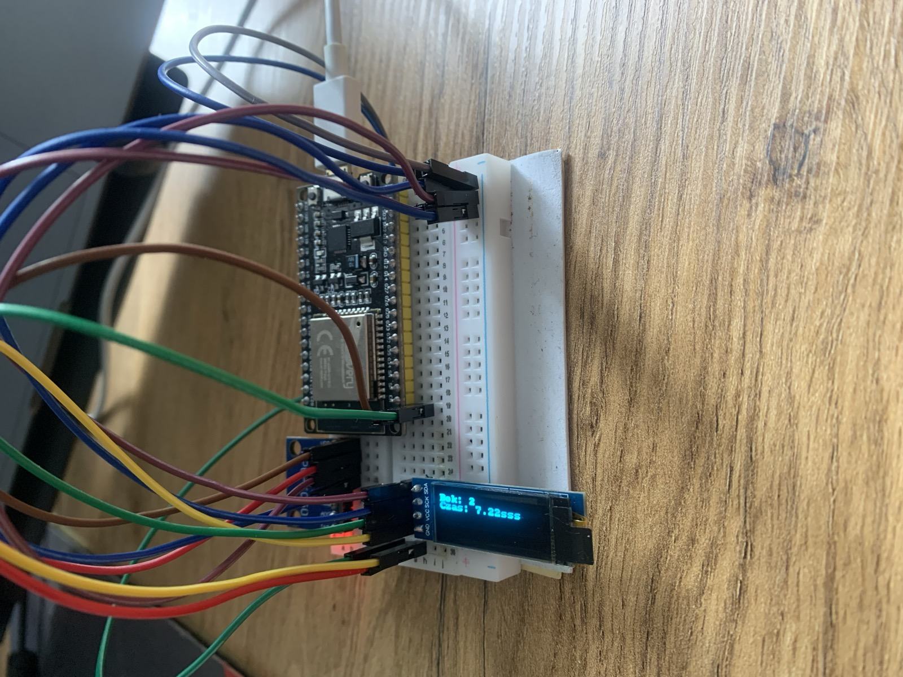
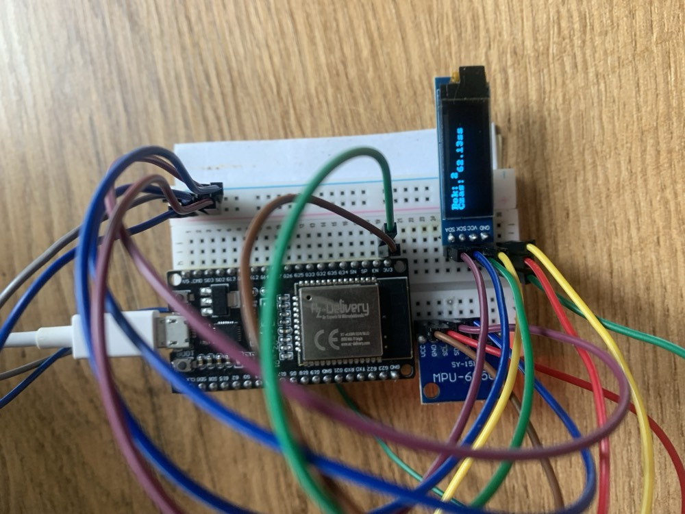
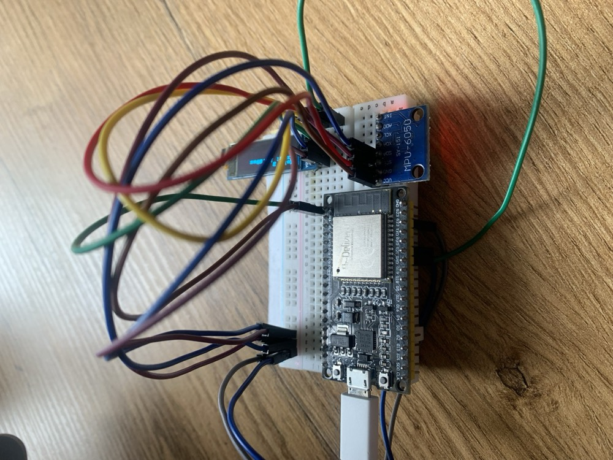

# Cube Timer

Fizyczna kostka do śledzenia czasu pracy. Kostka ma 6 boków - obracasz ją na
wybrany bok i automatycznie startuje stoper dla danej aktywności. Dane są
wysyłane przez WiFi do backendu, który zapisuje sesje pracy w bazie danych.

## Jak to działa

1. W kostce jest ESP32 z akcelerometrem MPU6050 - czujnik rozpoznaje, który
   bok jest teraz na górze (1-6).
2. ESP32 wysyła numer boku przez WiFi (UDP) do backendu za każdym razem, gdy
   bok się zmieni.
3. Backend (Java) odbiera te dane, zapisuje sesję pracy w bazie PostgreSQL i
   wysyła aktualizację dalej przez WebSocket
4. Na małym wyświetlaczu OLED w kostce widać na żywo, na którym boku
   aktualnie leży i ile czasu już na nim jest.

Bok 6 to tryb uśpienia - gdy kostka leży na tym boku, traktujemy to jako
"nic teraz nie robię", nie jako aktywność.

```
┌─────────────────┐       UDP        ┌─────────────────┐
│   ESP32 +       │  ────────────►   │   Java Spring   │
│   MPU6050       │                  │   Boot Backend  │
└─────────────────┘                  └────────┬────────┘
                                               │
                                               ▼
                                      ┌─────────────────┐
                                      │   PostgreSQL    │
                                      │   (Docker)      │
                                      └─────────────────┘
```

## Sprzęt

- ESP32 (płytka esp32dev)
- Akcelerometr MPU6050, adres I2C: 0x68
- Wyświetlacz OLED SSD1306 128x32, adres I2C: 0x3C

## Podłączenie (I2C)

- SCL -> GPIO 22
- SDA -> GPIO 21

MPU6050 i OLED wiszą na tej samej magistrali I2C (mają różne adresy).



## Zdjęcia







## Struktura projektu

```
Cube_Timer/
├── src/main.c              # firmware ESP32 (C, ESP-IDF)
├── components/              # biblioteki do OLED
├── include/
│   ├── wifi_config.h         # Twoja konfiguracja WiFi (nie w git)
│   └── wifi_config.example.h # przykład konfiguracji do skopiowania
├── platformio.ini           # konfiguracja PlatformIO
├── Cube_Backend/            # backend Java Spring Boot
└── docker-compose.yml       # baza PostgreSQL w Dockerze
```

## Jak uruchomić firmware (ESP32)

Potrzebujesz zainstalowanego PlatformIO.

1. Skopiuj `include/wifi_config.example.h` jako `include/wifi_config.h` i
   uzupełnij swoje dane (WiFi, IP komputera z backendem):
   ```
   cp include/wifi_config.example.h include/wifi_config.h
   ```
2. Wgraj program na płytkę:
   ```
   pio run --target upload
   ```
3. Podejrzyj logi na żywo:
   ```
   pio device monitor
   ```
   (prędkość 115200)

## Jak uruchomić backend

Potrzebujesz Java 21+, Maven (albo `./mvnw` z projektu) i Dockera.

1. Odpal bazę danych:
   ```
   docker compose up -d
   ```
2. Odpal backend:
   ```
   cd Cube_Backend
   ./mvnw spring-boot:run
   ```
   Backend nasłuchuje na porcie 8080 (HTTP/WebSocket) i 5000 (UDP - dane z kostki).


## Jak działa wykrywanie boku kostki

Akcelerometr oprócz ruchu czuje też grawitację - ta oś, która jest
skierowana w dół albo w górę, pokazuje odczyt bliski jednemu "g". Program
sprawdza, która z osi X/Y/Z ma odczyt najbliższy tej wartości, i na tej
podstawie zgaduje, który bok kostki jest teraz na górze.

Numeracja: Z+ = 1, Z- = 2, X+ = 3, X- = 4, Y+ = 5, Y- = 6 (6 to bok
uśpienia). Jeśli żadna oś nie jest wystarczająco blisko 1g (kostka w
ruchu albo pod skosem), program nic nie wysyła jako "pewny" bok.

## Jak działa pomiar czasu na wyświetlaczu

To osobny stoper liczony na samym ESP32 (niezależny od backendu). Liczy
czas, jak długo kostka leży na tym samym boku (1-5) - dopóki bok się nie
zmieni, czas leci dalej, nawet jeśli kostka stoi zupełnie nieruchomo.
Zmiana boku (albo bok 6 - uśpienie) zeruje stoper i zaczyna liczyć od nowa.


## Autor

Daniel Strielnikow
